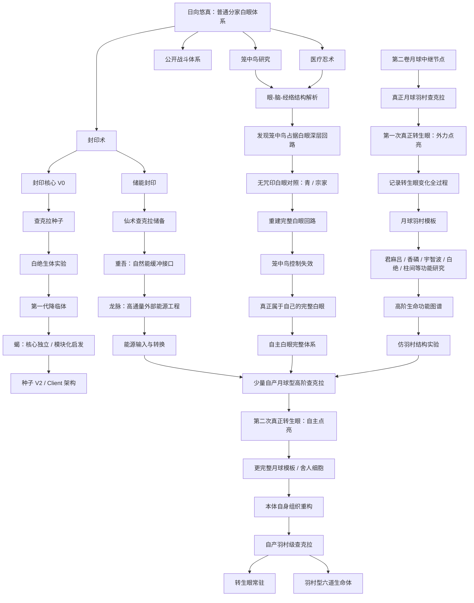
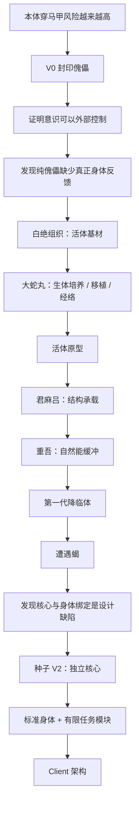
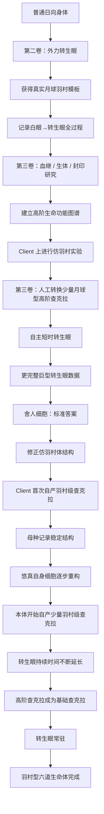

# 日向悠真完整能力升级设定

> 用途：作为《火影同人小说》后续卷纲、战力规划、技术路线与剧情收益设计的统一能力设定基准。  
> 核心原则：**降临体负责试错，本体负责进化；转生眼不是“升级次数”，而是悠真生命层次变化的结果。**

---

## 一、能力体系总原则

| 原则 | 设定 |
|---|---|
| **转生眼不存在“残缺版”** | 一旦真正转化，就是转生眼。区别只在于力量由谁提供、能维持多久、能不能自主再次开启。 |
| **查克拉量 ≠ 生命层次** | 储能封印、仙术可以让悠真拥有恐怖查克拉，但普通查克拉再多也不会自动变成羽村级查克拉。 |
| **血继不是拼装零件** | 君麻吕、重吾、香磷、宇智波等提供的是“生命机制”，不是把他们的血继一项项移植到悠真身上。 |
| **真正决定羽村路线的是原版模板** | 月球大筒木、巨型转生眼、后期舍人组织才是羽村体系的标准答案。 |
| **笼中鸟损伤的是白眼系统完整性** | 悠真血统本身不劣化，但眼睛—视神经—脑部—经络的部分回路被笼中鸟接管。 |
| **降临体是试验平台，不是最终身体** | 外部身体负责验证技术；最终成果必须回到原来的日向悠真身上。 |
| **本体最终不保留拼接细胞** | 白绝、柱间、君麻吕等都可以作为实验材料，但最终身体由悠真自身组织重新构建。 |
| **六道级必须是基础生命状态改变** | 最终不是靠开仙人模式、解封储能、启动种子才能达到，而是身体本身已经能产生和承载高阶查克拉。 |

---

## 二、七条能力主线

| 能力线 | 起点 | 中期目标 | 最终目标 |
|---|---|---|---|
| **公开忍者体系** | 白眼、柔拳、水遁、雷刺激、短刀、瞬身 | 精英上忍 → 影级 | 成为所有高阶力量的基础战斗框架 |
| **医疗＋封印** | 第一卷开始 | 解读笼中鸟、储能、种子、生体改造 | 操纵自身生命结构 |
| **白眼 → 转生眼** | 分家白眼 | 外力点亮 → 自主点亮 | 转生眼成为自然常态 |
| **笼中鸟** | 控制、封眼、伤脑 | 找出真正结构 → 建立旁路 | 完全失去控制能力并最终拆除 |
| **查克拉种子** | 封印锚点 | 生体控制核心、记录适应 | 母种成为本体生命重构核心 |
| **降临体 / Client** | 傀儡实验 | 白绝生体 → 模块化身体 | 分布式外部身体体系 |
| **羽村体 / 六道体** | 普通日向身体 | 仿羽村结构 → 自产少量高阶查克拉 | 原身体完成生命层次跃迁 |

---

## 三、总能力树



---

# 三A、当前确认的十五岁开篇能力与底层机制细化

> 近期增量设定：补全开篇能力、雷刺激、医疗、封印、储能与后期生命跃迁之间的因果。


1. 查克拉量

当前：约“一卡”。

含义： - 已经明显高于普通同龄忍者。 -
足够支持长时间白眼、成熟近战和常规任务。 - 不是漩涡/千手式巨量查克拉。 -
未来成长不能只写“一卡→十卡”，而要同时提高容量、功率和承载。

长期增长来源： - 年龄与正常身体成长。 - 长期体能训练。 -
雷刺激下的适度身体适应。 - 身体能量随身体强化而提高。 - 更高效的查克拉提炼。 -
后续储能封印不等于本体查克拉量，而是外加储备。

当前阶段，悠真的精神能量并不是主要短板：长期冥想、观想、学习、任务与实战经验都在持续强化精神侧。真正需要长期追赶的是身体能量与身体承载。

因此：

> **短期雷刺激主要提高功率；长期身体训练与适应则能够提高身体能量，在精神能量跟得上的前提下，推动本体查克拉总量继续增长。**

2. 查克拉控制【核心强项】

形成原因： - 穿越后较强的精神稳定性。 - 从小主动冥想与长期训练。 -
日向柔拳对查克拉精细控制的天然要求。 - 白眼能直接观察查克拉运行。 -
后续医疗训练进一步强化。

表现： - 能精确控制查克拉输出量。 -
能在穴位、掌指、局部身体进行精细调节。 -
雷刺激能使用远低于“雷遁铠甲”那种暴力输出的细小剂量。 -
医疗、封印、查克拉金属、储能封印、自然能缓冲全部建立在这一优势上。

后续意义： 查克拉控制是悠真整个技术树真正的“底层属性”。

------------------------------------------------------------------------

三、身体

当前状态

-   长期锻炼。
-   经历三战尾声与多年忍者任务。
-   速度、反应、协调、耐力优秀。
-   肌肉偏实战型，不追求巨大块头。
-   绝对力量不是核心长项。
-   远远不是凯那种把肉体开发到极端的体术忍者。

发展方向

不是练成纯肉体怪物，而是： - 提高神经反应。 - 提高肌肉启动效率。 -
提高心肺与循环承载。 - 提高查克拉经络对高流量的适应。 -
提高身体对高规格查克拉和自然能的耐受。

最终身体线要收束到： 普通日向身体 → 高规格查克拉承载体 →
仙人体/羽村体方向。

------------------------------------------------------------------------

四、白眼

不采用官方不存在的“看远/看近/控制评级”

作者后台可用四项描述：

1. 广域距离

开篇常态： - 数百米级广域侦察没有问题。 -
集中向单一方向观察可以明显更远。 -
暂不锁死精确极限数字，避免后续被数值卡死。

2. 精度

悠真真正突出的方向。 能高精度观察： - 穴位。 - 查克拉经络。 -
查克拉流动异常。 - 肌肉/神经附近的查克拉反应。 - 伤势与组织状态。 -
自己雷刺激时的查克拉运行。

2A. 观察边界【新增底层规则】

当前十五岁的悠真，白眼分辨率仍然停留在“查克拉层面”的高精度观察：

-   能看清穴位、查克拉经络、局部查克拉流动与异常反应。
-   能结合医学知识判断某一区域的肌肉、神经、组织可能出现问题。
-   能比较治疗前后某段经络的查克拉流动是否恢复、是否留下细微差异。
-   **不能直接逐个观察细胞，更不能像显微镜一样读取细胞排列与微观结构。**

因此必须长期坚持四层区分：

> **白眼解决“哪里不对”。**  
> **医学解决“为什么不对”。**  
> **研究与模板解决“理想状态应该是什么”。**  
> **真正的重构技术才解决“怎么把它变过去”。**

观察精度不等于医学理解，更不等于操作精度与身体重构能力。

即使后期白眼/转生眼观察能力进一步提高，也不能自动获得“人体历史蓝图”或生命结构答案。

3. 控制

-   随时启停。
-   长时间维持。
-   广域与局部精细观察之间快速切换。
-   白眼已经接近日常器官使用，不需要每次强调消耗。

4. 白眼“纯度”

可以写别人评价他的白眼很好、很纯，但不建立日向官方“纯度等级制度”。

后续作用

-   柔拳信息基础。
-   医疗观察工具。
-   雷刺激安全监控。
-   笼中鸟研究。
-   正常白眼/被咒印白眼/转生眼结构比较。
-   最终转生眼与羽村体研究入口。

------------------------------------------------------------------------

五、柔拳

当前定位

悠真基础柔拳极熟，对穴位和经络理解很深。

他不否定八卦六十四掌，也不认为传统柔拳弱。

他的判断是： - 六十四掌是一套很强的完整近身压制技术。 -
但真实战场环境复杂。 -
敌人有队友、远程忍术、陷阱、地形，不会总给你完整展开连击的机会。 -
悠真不愿把大量时间继续投入“更多掌数”。

因此他选择： 保留柔拳最本质的东西——精准把查克拉打进关键穴位/经络。

实战风格

-   一掌能破坏关键部位，就不追求六十四掌。
-   柔拳负责制造查克拉/动作破绽。
-   短刀负责快速结束。
-   瞬身和雷刺激负责把自己送到正确位置。

长期回收

柔拳真正留给悠真的，不只是战斗术，而是： 如何观察和干涉查克拉经络。

以后他会把“堵别人的经络”反过来变成：
“怎样让自己的经络更高效、更安全地运行。”

------------------------------------------------------------------------

六、短刀

来源

不写成木叶存在明确“公开短刀课程”。

合理设定： - 村内存在基础刀术/忍具训练渠道。 -
悠真学过基础持刀、步法、格挡、劈刺。 - 真正的个人风格来自战场。

风格

不是剑豪路线。

核心： - 白眼找破绽。 - 柔拳打乱查克拉/动作。 - 短刀制造致命结果。 -
刀也可以反过来逼迫防守，再用柔拳点穴。

查克拉金属

设定： - 普通金属不是绝对无法附着查克拉。 -
查克拉传导金属更适合接受、传导、保持查克拉，显著降低损耗和稳定难度。 -
“材料能不能高效传导”与“操作者能否稳定附着、控制形态”是两件事。

悠真未来： - 能把雷属性查克拉以很薄、稳定的形式沿刀锋传导。 -
不追求夸张雷光。 - 追求穿透、切割、麻痹与隐蔽性。

现实限制： - 好的查克拉金属贵。 - 封印实验也烧钱。 -
悠真不是生活贫困，而是研究经费长期不足。

------------------------------------------------------------------------

七、雷遁与雷刺激

1. 为什么不走千鸟/雷切

悠真研究过。

放弃原因： - 开发成本高。 - 与现有路线不够契合。 -
高速突进＋高显眼度不符合他的战场风格。 -
他习惯隐藏底牌，知道“棒打出头鸟”。 -
有白眼不代表必须证明“白眼也能玩千鸟”。

可保留穿越者吐槽： “帅是一辈子的事，命只有一条。”
“他也不确定自己还能不能重开。”

2. 当前雷刺激

不是雷影的雷遁查克拉模式，而是同一底层思路下更低功率、更高精度的个人路线。

分为两个使用尺度。

**日常训练 / 身体调节：**

-   极低强度刺激神经、肌肉、心肺与循环系统；
-   调整身体活跃程度与查克拉运行效率；
-   让身体长期适应略高于当前常态的负荷；
-   目标之一是提高身体能量与查克拉提炼能力，而不是靠瞬间刺激凭空造查克拉。

**战斗爆发：**

-   按需把雷属性查克拉送到对应神经、肌肉与查克拉经络；
-   降低反应延迟，提高肌肉瞬间启动；
-   强化起步、急停、变向、横移、挥刀等极短时间动作；
-   不追求全程最高速度，更重视突然改变节奏。

穴位与查克拉经络承担的是精确输送与调度，不把“刺激穴位”本身写成神经反应加速的直接原因。

外观： 尽量不浑身冒雷。敌人更可能只感觉“这个日向突然快了一截”。

3. 医疗、白眼与观想加入后的升级

雷刺激不是单纯“加大电流”。

悠真的研究闭环是：

> **白眼观察查克拉经络与局部反应 → 观想强化自身细微反馈 → 医疗知识判断异常性质 → 查克拉控制精确调整刺激位置、强度和持续时间。**

他逐渐形成“动态负荷测试”的思路：

1. 正常查克拉运行；
2. 低强度雷刺激；
3. 接近实战强度；
4. 比较不同阶段最先出现异常的部位；
5. 判断是肌肉、神经、心肺还是查克拉经络先到达承载上限。

这让悠真能够比普通忍者更早发现“尚未形成明显伤势、但已经开始逼近上限”的信号。

注意：

> **观想提高的是自身感知的信噪比，不提供细胞级视野。**
>
> **白眼看得更清楚，也不代表悠真已经知道人体为什么会产生这种变化。**

4. 即时效果、训练适应与损伤必须分开

### 即时效果

不凭空增加查克拉总量。 主要提高： - 神经响应。 - 肌肉爆发。 -
查克拉流动效率。 - 单位时间可调用的查克拉功率。

### 长期训练的正确路线

真正有效的长期训练不是：

> **练伤 → 医疗忍术治好 → 再练伤 → 无限循环。**

而是尽量把强度控制在：

> **足以让身体产生适应压力，但尚未形成明确创伤的负荷窗口。**

正确循环：

> **刺激 → 观察 → 判断 → 恢复 → 身体适应 → 再小幅提高负荷。**

长期结果可以包括：

-   身体逐渐适应更高负荷；
-   神经反应与肌肉启动效率提高；
-   心肺、循环系统承载提高；
-   查克拉经络对高流量与高功率输出的适应增强；
-   身体能量随长期训练提高；
-   查克拉总量因此缓慢增长。

### 为什么不采用“故意创伤＋医疗修复”的暴力刷法

悠真早期可以产生过这种穿越者式思路：

> 既然自己有白眼、查克拉控制和医疗能力，能不能故意把训练强度推到受伤，再治好继续练？

理论上这种方法短期可能提高训练频率，也可能让他更快接触高负荷。

但白眼观察实际医疗过程与自身实验后，他逐渐确认：

> **治疗损伤，不等于身体回到受伤前的历史状态。**

医疗忍术没有一份“原始身体蓝图”。

它能够：

-   促进损伤组织恢复；
-   重新建立正常功能；
-   让中断或紊乱的查克拉循环恢复工作；
-   处理明确的肌肉、神经、组织与经络损伤。

但它不能自动保证：

-   修复后的微观结构与受伤前完全一致；
-   已经稳定成型的经络重新恢复成过去某个状态；
-   一个“功能正常但高负荷性能下降”的部位被自动识别成伤势；
-   治疗一次就把查克拉经络变得更宽、更坚韧、承载更高。

因此反复：

> **创伤 → 快速治疗 → 再创伤**

可能出现一种危险结果：

平时检查一切正常，查克拉也能顺利流动；但在实战级高负荷下，某些部位会比过去更早出现滞涩、疼痛或承载极限。

这类稳定结构变化已经不再是普通“伤口”，医疗忍术未必存在明确修复目标。

所以悠真最终放弃把医疗忍术当作“训练回血工具”。

医疗在雷刺激训练中的正确定位是：

> **诊断工具＋安全保障＋真正受伤后的修复手段。**

该治疗的损伤必须治疗；但正常训练尽量避免主动制造损伤。

### 过量刺激的后果

-   神经损伤；
-   肌肉撕裂；
-   心肺负担；
-   查克拉经络损伤；
-   长期反复创伤与修复可能形成稳定但不理想的结构变化。

因此不是越电越强，也不是“只要会医疗就可以无限超负荷”。

5. 后期“身体调节模式”

不要简单做成“悠真版雷遁铠甲”。

研究方向： - 神经。 - 肌肉。 - 心肺。 - 循环。 - 查克拉经络。 -
不同战斗场景动态调节不同系统。

追击：腿部＋心肺。 近战：反应＋腰腹＋上肢。
爆发：经络高功率输出＋肌肉启动。 受伤撤离：降低部分输出、保护关键系统。

这套模式最终的价值不是多一个BUFF，而是悠真第一次学会：
主动调试自己的身体。

------------------------------------------------------------------------

八、医疗忍术

开篇

-   已有基础战场急救能力，不是回村后才从零开始学习。
-   止血。
-   清创。
-   基础伤势判断。
-   常见外伤与简单内部伤势的处理。
-   能使用基础医疗查克拉进行修复与稳定。
-   不是专业医疗忍者水平，更不是纲手、兜级别的人体专家。

第一卷升级

第一卷不是“第一次看到医疗忍术以后才决定学习”，而是继续把原本为了生存学到的医疗能力系统化。

重点是对白眼已经能够看到的东西建立真正的医学“语言”：

-   组织；
-   神经；
-   肌肉；
-   查克拉经络；
-   脏器；
-   循环；
-   损伤、修复与长期适应之间的区别。

### 医疗底层规则【新增】

医疗忍术不是时间倒流，也不存在自动读取“受伤前完美状态”的历史存档。

以掌仙术类治疗为典型，其本质更接近：

> **利用精密查克拉操作促进、引导身体当前的修复过程，让受损组织重新恢复正常功能。**

因此必须严格区分四个概念：

| 层级 | 含义 | 当前悠真能否处理 |
|---|---|---|
| **疲劳 / 负荷** | 没有明确结构损伤，只是高强度使用后的暂时状态 | 主要依靠正常恢复 |
| **损伤 / 修复** | 已有明确肌肉、神经、组织或查克拉经络损伤 | 基础部分可以医疗介入 |
| **适应 / 提升上限** | 身体在训练后形成更高承载与更高效率 | 不能靠医疗忍术直接“治出来” |
| **结构重构** | 主动把一个健康但性能不足的身体结构改造成另一种结构 | 开篇完全不具备，属于后期身体工程 |

核心规则：

> **治疗损伤 ≠ 恢复历史原状 ≠ 提升身体上限 ≠ 主动重构身体。**

一段经络只要已经完整、查克拉能够正常通过、没有明确病理损伤，普通医疗忍术就可能判断它“已经好了”。

但它仍然可能在高负荷雷刺激下比其他部位更早达到极限。

这也是悠真后来认识到的关键：

> **静态健康，不等于高负荷性能完美。**

### 白眼对医疗的真正优势与限制

优势：

-   能直接观察查克拉经络和穴位；
-   能比较治疗前后查克拉循环变化；
-   能更早发现局部异常；
-   能给医疗查克拉提供极高精度的定位反馈。

限制：

-   当前不能直接逐个观察细胞；
-   看见异常不等于知道异常的医学原因；
-   看见修复后的经络不等于知道受伤前每一处微观结构；
-   白眼没有“历史回放”，无法提供身体原始蓝图。

因此悠真通过观察医疗忍术修复过程，可以发现：

> 某段受损经络在治疗后已经重新贯通，功能上属于“治好”；  
> 但与未受伤区域相比，查克拉流动仍可能留下极细微差异。

这不是说明医疗忍术无效，而是让悠真第一次真正意识到：

> **修复与完全复原，是两回事。**

### 医疗忍术为什么仍然重要

医疗不会因此失去价值。

它在悠真体系里的长期作用是：

-   处理训练和任务造成的真实损伤；
-   缩短严重损伤后的恢复周期；
-   判断哪些反馈属于正常适应，哪些已经跨入危险损伤；
-   为雷刺激提供安全边界；
-   建立眼—脑—经络研究基础；
-   后续进入组织培养、移植、排异、人工身体等真正生体工程领域。

中期

医疗不只是救人，而是：

-   雷刺激动态负荷研究；
-   白眼 / 眼—脑—经络研究；
-   组织培养；
-   移植与排异；
-   人工身体；
-   君麻吕疾病；
-   高负荷身体损伤模型；
-   “修复”与“重构”的技术边界研究。

后期

医疗知识最终服务于：

> **从“治疗一个已经存在的身体”，逐步走向“理解并重新设计能长期承载高规格力量的身体”。**

真正的主动重构必须额外解决：

-   理想结构从哪里获得；
-   如何观察到足够细的层级；
-   如何控制细胞和组织按目标重新分化；
-   如何避免排异、癌变、失控与功能错配；
-   如何证明新结构比原结构更稳定。

因此查克拉手术刀、再生术等最多证明“身体结构可以被干预”，不等于悠真已经拥有安全的人体编辑能力。

------------------------------------------------------------------------

九、封印术

开篇水平

日向与村子对高阶知识限制严格。

悠真能接触的主要是： - 常用卷轴。 - 储物/封物结构。 - 基础术式。 -
可购买或任务中常见的封印用品。

学习方式： - 使用。 - 拆解。 - 临摹。 - 失败。 - 对比。 -
逐渐理解术式、触发、查克拉维持和释放。

现实限制

很烧钱： - 卷轴。 - 特殊纸张。 - 墨。 - 材料。 - 实验失败品。

形成“任务报酬够生活，但研究经费永远不够”的长期设定。

成长方向

封印术不是悠真的主战斗职业，而是工程工具。

最终服务： - 笼中鸟。 - 储能。 - 限流。 - 分流。 - 缓冲。 - 种子。 -
静室接口。 - 降临体。 - 自然能隔离。 - 大型能源系统。

------------------------------------------------------------------------

十、阴封印/百豪类自研储能封印

原则

悠真知道前世存在“长期把查克拉储存起来”的思路，但没有完整百豪术式。

因此是自研，不是纲手直接传授。

第一阶段：储存

把日常多余查克拉长期储存。

第二阶段：释放

战斗时重新调用。

第三阶段：限流

发现“有五卡储备”不代表身体能一口气承受五卡。 开始控制释放速度。

第四阶段：分流

把查克拉按不同路径送往： - 眼睛。 - 四肢。 - 医疗。 - 雷刺激系统。 -
其他术式。

第五阶段：缓冲/调压

储能封印从“大蓝瓶”变成人体查克拉系统的调节器。

最终回收

这套技术未来直接衔接： - 转生眼高耗能。 - 自然能输入。 -
龙脉级外部能源。 - 仙人体/羽村体高功率运行。

------------------------------------------------------------------------

十一、幻术

施术

基本不会，不走幻术路线。

抗性

较好，原因叠加： - 精神力较强。 - 长期冥想。 - 白眼观察查克拉。 -
基础解幻术训练。 - 精神空间可能存在帮助，但无法确认。

原则： 不写幻术免疫。 真正的幻术高手仍然危险。

------------------------------------------------------------------------

十二、精神空间 / 静室

起源

穿越后为了不逐渐失去原本的自我，悠真从小冥想、整理记忆、确认自我。

最初的“一团火”只是精神锚点，不是外挂。

十二岁遗迹异常后： - 特殊查克拉与白眼共鸣。 - 剧烈头痛。 -
悠真下意识进入熟悉的冥想状态。 - 原本需要主动想象维持的锚点被固定。

开篇功能

只有： - 快速平静。 - 集中精神。 - 内观。 - 复盘。 -
可能提高查克拉提炼稳定性。 - 可能提高幻术抗性。

没有： - 时间加速。 - 恢复查克拉。 - 模拟忍术。 - 储物。 - 读心。 -
保存灵魂。

第二卷

转生眼再次开启后稳定成真正“静室”。

第三卷

通过种子出现外部席位。

后续

发展成秘密精神网络，但必须保留限制： - 主动接入。 - 不能强拉。 -
不能读心。 - 不能复活死人。

------------------------------------------------------------------------

十三、笼中鸟

悠真的态度

复杂，不是单纯仇恨。

负面： - 宗家握有控制与杀伤权。 - 限制白眼。 -
自己的生命与眼睛不完全属于自己。

正面现实： - 三战时期，分家白眼因笼中鸟存在而降低了敌人夺眼的价值。 -
悠真承认它可能客观上让自己更容易活下来。

核心态度： “它保护过我，不代表我愿意让别人一辈子握着我的命。”

开篇研究

-   曾用自身查克拉直接接触/试探。
-   遭到强烈痛苦。
-   很久不敢再暴力尝试。
-   明白在不了解术式前拿脑袋做实验等于找死。
-   因此转向医疗＋封印＋白眼结构研究。

第二卷

转生眼状态下发现： - 笼中鸟不是简单压制。 -
可能长期占据/改写眼—脑—经络运行通路。 - 转生眼高阶循环可以暂时架空它。

第三卷

先恢复正常结构，再拆分控制、疼痛/杀伤、死后毁眼、深层占位。
最终实质破解。

------------------------------------------------------------------------

十四、转生眼

开篇

只是高度怀疑。 悠真知道原作存在转生眼，也知道自己正常条件并不满足。

十二岁遗迹事件： - 未知/羽村性质查克拉与白眼强烈共鸣。 -
可能短暂真正转化过。 - 持续极短、无法控制、无法复制。 -
悠真无法证明，只留下精神空间异常。

第二卷

再次获得少量真实羽村性质查克拉。 真正开启并记录。

关键拆成两个问题：

点火量

一小股正确性质的羽村高阶查克拉，让白眼进入转生眼状态。

维持量

巨量持续查克拉，让转生眼真正运行和使用能力。

第二卷遗迹暂时同时提供两者。 矢仓战全部烧光。

第三卷

通过： - 完整白眼结构。 - 真实祖系印记。 - 种子。 - 自然能缓冲。 -
封印。 终于能自己制造极少量“点火量”。

龙脉提供维持所需巨大能源。 第一次自主点亮。

但离开龙脉后仍无法稳定维持。

第四卷

靠长期储能准备一次极昂贵的点火机会。 仍然是底牌，不是常态模式。

最终问题

真正稳定转生眼需要： 身体本身自然生成、承载羽村级查克拉。

这直接通向仙人体/羽村体。

------------------------------------------------------------------------

十五、影级门槛与矢仓战的战力逻辑

悠真的常规上限

传统柔拳单独继续深挖，在悠真看来很难自然解决真正影级敌人的综合问题。

但： 白眼＋雷刺激＋瞬身＋点穴柔拳＋短刀＋医疗＋储能封印
可以把他的常规体系推到影级门槛。

为什么仍打不过真正怪物

悠真的问题不是不会战斗，而是： 伤害上限与力量规格。

面对一般忍者： - 点穴有效。 - 动作破坏有效。 - 短刀能致命。 -
速度能制造决定性机会。

面对矢仓这类： - 巨大查克拉储备。 - 人柱力恢复/尾兽查克拉。 -
大范围攻击。 - 强控制。 - 高防御。 - 高输出。 - 没有明显短板。

悠真可能： - 看得见。 - 躲得开。 - 打得中。 却杀不掉。

这就是他探求更高生命层次力量的真正动机。

------------------------------------------------------------------------

十六、澪三勾玉与人物线对能力成长的影响

矢仓战后： - 悠真爆发重创矢仓，自己重伤。 -
矢仓识破悠真是短时间爆发，发动追杀。 - 澪独自承担逃亡。 -
在真正雾隐强者压力下开启三勾玉。 -
三勾玉的作用是“终于能把悠真带出去”，不是抢主角终战高光。

战后： - 两人正式确定关系。 -
悠真反而开始主动把她排除在最危险研究与任务之外。 - 他更多与止水合作。 -
这会形成后续感情矛盾：悠真认为是保护，澪认为他在替自己决定人生。

能力层面： - 止水的瞬身体系会继续影响悠真对“速度”的理解。 -
澪的写轮眼/幻术测试继续作为精神与视觉体系的外部参照。 -
第四卷澪万花筒最终与悠真的转生眼/空间状态产生直接互动。

------------------------------------------------------------------------

---

# 四、第一卷：普通日向体系走到极限之前

## 1. 开局状态

| 项目 | 水平 |
|---|---|
| 查克拉量 | 同龄人中极强，长期锻炼带来的优势 |
| 白眼 | 正常优秀日向白眼，但受笼中鸟体系影响 |
| 柔拳 | 成熟 |
| 雷刺激 | 初步实战化，主要用于瞬间加速 |
| 水遁 | 实用型 |
| 短刀 / 忍具 | 成熟 |
| 综合战力 | 资深中忍上下，战斗经验明显高于年龄 |

## 2. 第一卷真正强化的能力基础

### 医疗忍术
悠真开篇已经有基础战场医疗能力，第一卷不是“从零学会医疗”。

这一阶段真正推进的是：

- 把过去为了生存掌握的止血、清创、伤势判断系统化；
- 由柔拳“破坏经络”的知识反向理解经络的正常运行与损伤；
- 用白眼观察医疗忍术治疗前后的查克拉循环变化；
- 认识到“治疗后功能恢复”与“完全恢复到受伤前结构”不是同一件事；
- 放弃把“故意练伤 → 医疗治好 → 再练伤”当作雷刺激升级捷径；
- 开始寻找“足以诱发身体适应、又不造成明确创伤”的训练负荷窗口；
- 为后续眼—脑—经络研究和生体工程建立基础。

### 笼中鸟认知
第一卷末发现：

> 笼中鸟不是额头上单独存在的一枚术式，而是已经深入白眼—视神经—脑部查克拉节点—头部经络。

因此第一卷提出的真正问题不是“找到解除术”，而是：

> **怎样在不毁掉白眼和大脑的情况下，把笼中鸟从生命系统中拆出去。**

---

# 五、第二卷：第一次看见真正终点

## 1. 正常战力成长

| 技术 | 第二卷变化 |
|---|---|
| **雷刺激** | 从瞬时强化变成可以持续用于战斗的身体增幅 |
| **柔拳** | 与速度、短刀、白眼融合，真正达到上忍级近战 |
| **医疗** | 可以承担更完整的战地医疗，并结合白眼进行动态负荷判断与精细修复；仍不具备主动重构健康经络结构的能力 |
| **封印术** | 警戒、储物、查克拉抑制、简易结界、术式解析正式进入实战 |
| **水遁** | 在水之国形成真正海战体系：水幕、水面瞬身、水下白眼、高压水线等 |
| **储能封印** | 建立最早雏形，但容量和释放效率有限 |

第二卷中后期正常状态：

> **强上忍。**

面对矢仓时能够依靠白眼、速度、封印准备和海战体系周旋，但没有常态击败矢仓的可能。

---

## 2. 青的白眼：无咒印白眼参照

设定建议：

- 青的白眼来自三战时期某位日向宗家旁系成员；
- 没有笼中鸟；
- 青本人不必死亡；
- 悠真以秘密身份取回白眼；
- 不用于移植，而用于建立“无咒印白眼”结构参照。

其价值不是“给悠真换一只更好的眼睛”，而是：

> **告诉悠真：正常的白眼—视神经—脑部—经络回路本来应该是什么样。**

---

## 3. 第二卷转生眼体验卡

### 羽村遗迹的定位

第二卷的羽村遗迹建议定义为：

> **月球巨型转生眼留下的地球侧观察 / 中继节点。**

它并不是单独保存一套完整羽村外挂，而是曾经与月球羽村后裔体系相连。

### 矢仓终战触发：第二次真正开启

当悠真被矢仓逼入绝境：

```text
日向白眼
+
真正月球羽村后裔查克拉
=
真正转生眼
```

这一次：

- 不是残缺转生眼；
- 不是“弱化版转生眼”；
- 是真正完成过一次眼部质变；
- 只是力量来源不属于悠真本人。

### 为什么战后退回白眼

两个原因：

1. 月球侧高阶查克拉消失；
2. 笼中鸟重新接管被临时压制的深层白眼回路。

因此体验卡留下的真正财富是：

> **一次在清醒、主动战斗条件下记录下来的完整“白眼 → 转生眼”全过程数据。**

正文前十二岁时的第一次转化虽然也是真正转生眼，但时间极短、不可控制、记录能力有限；第二卷的价值在于悠真终于能把这次变化当作可研究对象。

---

# 六、月球样本：真正的标准答案

第二卷中继节点除了查克拉，还应该留下非常有限的真实样本，例如：

- 古老月球白眼组织；
- 极少量月球大筒木细胞；
- 无法补充的高阶查克拉样本。

限制：

- 数量极少；
- 不能直接移植强化；
- 只能测量、培养、比较；
- 无法直接让悠真永久转生眼化。

其作用相当于：

> **芯片成品 / 标准样品。**

后续所有血继研究只能解决“怎样制造”，而月球样本告诉悠真：

> **究竟应该制造成什么样。**

---

# 七、第三卷前期：人工白眼失败与笼中鸟真相

## 1. 人工白眼失败

悠真尝试使用：

- 自身细胞；
- 白绝培养基；
- 查克拉种子；
- 医疗忍术；

培养人工白眼。

结果可以出现：

- 白色眼球组织；
- 基础查克拉感知；
- 部分白眼特征；

却始终无法复制完整性能。

最关键的是：

> 每一批人工白眼都在相同结构上出现同样的“断路”。

开始悠真以为是培养技术问题。

直到他同时比较：

- 自己的白眼；
- 人工白眼；
- 青的无咒印白眼；
- 日足等宗家活体白眼；
- 月球样本；

才发现：

> **种子一直忠实地复制悠真，但悠真自己本身就是被笼中鸟改写后的模板。**

---

# 八、笼中鸟三层结构

| 层级 | 功能 |
|---|---|
| **表层术式** | 额头印记、宗家控制接口 |
| **中层经络结构** | 疼痛、神经破坏、查克拉干扰 |
| **深层白眼锁** | 接入眼睛—视神经—脑部回路，死亡时封锁白眼，同时占据部分深层反馈通路 |

这解释了：

> 为什么不能直接暴力破解笼中鸟。

因为强行摧毁可能同时毁掉：

- 白眼；
- 视觉神经；
- 脑部；
- 查克拉循环。

---

## 笼中鸟破解流程


---

# 九、查克拉种子的起源

查克拉种子最初不是“血继收集器”。

它的原型只是：

> **封印核心 V0。**

目的：

- 识别悠真的查克拉；
- 保存精神锚点；
- 维持远程控制；
- 作为外部载体的身份认证结构。

死术式适应性太差以后，悠真开始加入：

- 活体组织；
- 自我调节结构；
- 查克拉适应机制。

于是逐渐形成：

> **查克拉种子。**

---

# 十、查克拉种子记录什么

种子不复制具体血继技能，而记录：

> **特殊生命长期承载某类查克拉后，身体形成了哪些稳定结构。**

| 对象 | 真正记录内容 |
|---|---|
| **白** | 两种性质如何在一个生命查克拉系统中稳定共存 |
| **君麻吕** | 阳性查克拉如何参与骨骼、硬组织、骨髓形成 |
| **重吾** | 自然能如何进入人体、缓冲、储存、转换 |
| **香磷** | 高生命力、高查克拉量、高恢复对应的身体结构 |
| **宇智波** | 精神 / 阴性查克拉怎样永久改变瞳术器官 |
| **白绝** | 高可塑、组织兼容、快速重构 |
| **柱间细胞** | 极高阳性生命力与再生能力的参照 |

最终建立的是：

> **高阶生命功能图谱。**

而不是“血继技能列表”。

---

# 十一、降临体技术路线

## V0：普通傀儡

最早悠真只尝试：

- 人形傀儡；
- 封印核心；
- 精神 / 查克拉远程控制。

问题：

- 没有触觉；
- 没有真正经络；
- 没有内耳平衡；
- 身体反馈极差；
- 柔拳无法发挥；
- 像第一人称遥控机器人。

结论：

> **真正第二身体必须是活体。**

---

## 白绝：第一代生体基材

白绝追踪悠真组织后被捕获 / 击杀。

悠真发现其组织：

- 活性异常；
- 兼容性高；
- 可塑性强；
- 经络完整；
- 对异种查克拉排斥较低。

因此采用：

> **白绝衍生组织**

而不是直接拿一个完整白绝洗脑当身体。

---

## 大蛇丸：生体工程来源

大蛇丸体系提供：

- 组织培养；
- 人工循环；
- 移植；
- 咒印长期驻留；
- 异常组织维持；
- 经络改造。

它解决的是：

> **怎样把一块能活的组织真正培养成一个能工作的身体。**

---

## 君麻吕：承载结构

君麻吕研究解决：

- 骨骼强度；
- 肌腱结构；
- 高强度查克拉对身体的冲击；
- 硬组织修复；
- 骨髓与阳性生命力关系。

悠真不会因此获得尸骨脉。

---

## 重吾：外部能源接口

重吾研究解决：

- 自然能如何进入生命体；
- 如何缓冲；
- 如何避免暴走；
- 怎样使外部能源与精神状态解耦。

悠真也不直接复制咒印仙人化。

---

## 第一代降临体

| 部件 | 来源 |
|---|---|
| **主体组织** | 白绝衍生组织 |
| **骨骼 / 承载设计** | 君麻吕研究 |
| **经络** | 按悠真战斗习惯重新设计 |
| **能源缓冲** | 重吾研究 |
| **核心** | 查克拉种子 |
| **控制** | 悠真意识真正降临 |
| **稳定 / 自毁** | 封印术 |
| **培养技术** | 大蛇丸体系 |

限制：

> **第一代不能和本体同时战斗。**

悠真意识进入降临体后，本体处于深度静息 / 低活动状态。

---

# 十二、蝎：降临体架构启蒙

蝎不是降临体技术来源，而是：

> **把悠真的第一版设计打碎的人。**

第一代降临体的问题：

- 核心与身体绑定；
- 重要功能全部长死；
- 一处致命损伤导致整具身体报废；
- 升级困难；
- 模块化不足。

蝎让悠真意识到：

- 核心应当独立；
- 身体应当可替换；
- 功能应当模块化；
- 战斗身体只是载体，不是自我本身。

于是产生：

> **查克拉种子 V2。**

---

## 降临体技术流程



---

# 十三、龙脉：能源工程，而不是羽村钥匙

龙脉不能直接解决生命层次。

它解决的是：

> **怎样处理远大于单个忍者承载能力的外部能源。**

悠真可以封存少量龙脉查克拉样本。

限制：

- 不可再生；
- 离开源头后逐渐衰减；
- 直接灌入人体极危险；
- 主要用于研究，而不是战斗电池。

---

## 龙脉技术收益

| 问题 | 龙脉提供的答案 |
|---|---|
| 巨量外部查克拉怎么进入人体 | 限流、缓冲、转换 |
| Client 怎么远程供能 | 能源节点 |
| 高阶身体怎样做压力测试 | 可控制高通量实验 |
| 转生眼需要大量能源怎么办 | 让“能源数量”和“高阶查克拉性质”彻底分工 |
| 网络以后怎么运作 | Client 不必每具身体都背完整查克拉池 |

因此：

> **仙术＋储能＋龙脉解决“量”。**  
> **月球羽村体系解决“质”。**

---

# 十四、仙术的正确定位

悠真不必走传统“固定仙人模式”路线。

更适合他的方案是：

> **自然能工业化。**

结构：

1. 自身查克拉长期储存；
2. 自然能单独封印；
3. 需要时由种子 / 封印结构按比例混合；
4. 产生大量仙术查克拉。

因此后期悠真可以拥有极其恐怖的：

> **仙术查克拉储备。**

但这仍然只是高质量能源，不是羽村查克拉。

---

# 十五、羽村体：真正生命跃迁的核心

“羽村体”只是设计阶段称呼。

真正意义是：

> **一个能够自然产生月球羽村后裔性质高阶查克拉的生命体。**

不能使用简单公式：

```text
君麻吕 + 香磷 + 柱间 + 宇智波 = 羽村
```

正确结构应当是：

```text
月球羽村模板
        ↓
定义目标结构
        ↓
忍界各血继研究
        ↓
提供不同生命功能的实现工艺
        ↓
白绝 / Client
        ↓
低风险实验平台
        ↓
查克拉种子 / 母种
        ↓
将验证成功的结构重新写回悠真自身组织
```

---

# 十六、三类研究材料

| 类型 | 代表 | 用途 | 是否属于“羽村标准答案” |
|---|---|---|---|
| **真实模板** | 月球巨型转生眼、月球大筒木组织、后期舍人细胞 | 告诉悠真正确羽村结构是什么 | **是** |
| **功能模块** | 君麻吕、重吾、香磷、宇智波 | 解决某项生命功能如何实现 | **否** |
| **实验底盘 / 工具** | 白绝、柱间细胞、龙脉、仙术、封印术 | 让重构实验能够进行 | **否** |

---

# 十七、月球模板三级

| 阶段 | 模板来源 | 完整程度 |
|---|---|---|
| **第二卷** | 地球侧中继节点、极少月球组织、一次真正转生眼体验 | 只能知道大致方向 |
| **中期** | 巨型转生眼更深层组织 / 数据 | 可以真正反推月球羽村体系 |
| **后期** | 舍人活体细胞 | 现存羽村后裔“标准答案” |

舍人样本不能太早出现。

真正有价值的体验应该是：

> 悠真已经逆向工程很多年，后来终于拿到“标准答案”，检查自己究竟做对了多少。

---

# 十八、第三卷自主转生眼：不是完成羽村体，而是造出“点火装置”

第三卷还不能让身体自产羽村级查克拉。

真正突破是：

> **第一次人工转换出极少量接近月球羽村后裔性质的高阶查克拉。**

输入可能包括：

- 悠真自身查克拉；
- 大量储能；
- 仙术能量；
- 月球模板数据；
- 查克拉种子；
- 封印结构。

但转换效率极低。

例如：

```text
100 单位普通 / 仙术查克拉
↓
复杂转换
↓
1 单位真正符合月球模板的高阶查克拉
```

这一单位进入已经恢复完整回路的白眼：

> **第一次真正由悠真自主制造点火条件的转生眼。**

若按实际开启次数计，这是第三次真正转生眼；若按技术阶段计，这是“自主点火”的第一次。

与第二卷区别：

| 第二卷 | 第三卷 |
|---|---|
| 外部月球力量点火 | 悠真自己造出点火条件 |
| 体验卡 | 可重复但成本极高 |
| 不知道发生了什么 | 已掌握部分转换机制 |
| 外力决定持续时间 | 自己储备与转换效率决定持续时间 |

---

# 十九、第三卷末能力状态

| 项目 | 状态 |
|---|---|
| **正常战斗力** | 精英上忍顶端～影级门槛 |
| **储能封印** | 成熟 |
| **仙术查克拉** | 可储备、战时混合 |
| **笼中鸟** | 控制 / 杀伤核心失效，残余结构继续清理 |
| **Client** | 第一代真正可用 |
| **种子** | V2，核心独立 |
| **转生眼** | 可自主制造条件短时开启 |
| **转生眼战力** | 明显高于普通影级，短时间进入六道层次门槛 |
| **最大瓶颈** | 身体自身仍不会自然生产羽村级查克拉 |

---

# 二十、第四卷：不再升级，开始大型实战验证

第四卷宇智波之夜原则：

> **不继续大量增加新能力。**

使用第三卷已经完成的：

- 影级基础战斗力；
- 白眼；
- 储能；
- 仙术查克拉；
- 封印；
- Client；
- 转生眼底牌。

第四卷能力线真正新增的重要数据来源是：

> **澪的万花筒觉醒。**

悠真第一次完整观察：

```text
三勾玉
→ 极端精神刺激
→ 阴性查克拉质变
→ 眼球器官永久重构
→ 万花筒
```

这为后面解决：

> **怎样让白眼永久保持转生眼结构**

提供关键瞳术器官重构经验。

---

# 二十一、中后期：仿羽村体

获得更完整：

- 巨型转生眼数据；
- 月球大筒木组织；
- 舍人细胞；

以后，悠真才真正开始构建：

> **仿羽村体 V1。**

先在 Client 上实验。

判断成功的真正标准：

> **身体能够自己稳定产生符合月球样本的高阶查克拉。**

不是依靠转换器。

只有这一步成功，才说明生命结构真正对了。

---

# 二十二、本体重构原则

不能采用：

- 柱间细胞永久拼接；
- 君麻吕细胞永久拼接；
- 重吾组织永久拼接；
- 白绝组织永久替代本体。

正确路线：

1. 外部实验体验证某种机制；
2. 母种记录；
3. 以悠真自己的干细胞、骨髓、经络、器官组织重新分化；
4. 逐渐实现同样功能；
5. 外来组织只作为实验模板和脚手架。

最终仍然是：

> **日向悠真自己的身体。**

---

# 二十三、真正羽村型生命跃迁的判断标准

| 指标 | 最终状态 |
|---|---|
| **高阶查克拉** | 身体自然产生，不再需要外部转换 |
| **转生眼** | 常驻，不再需要“开启” |
| **自然能** | 能够自然纳入生命循环，不需要传统仙人模式 |
| **查克拉容量** | 本身巨大，外部储能只是战略储备 |
| **恢复能力** | 高阶生命体级别 |
| **阴阳性质** | 本身达到高水平协调 |
| **五种性质** | 完整融入自身查克拉体系，而不只是“会使用五遁” |
| **笼中鸟** | 完全不存在 |
| **外部细胞依赖** | 无 |
| **身份连续性** | 大脑、意识、双眼、核心始终属于原来的日向悠真 |

---

# 二十四、本体生命跃迁流程



---

# 二十五、仙人眼与仙人体不是两条独立升级线

最终应理解为：

> **眼与体是同一生命层次变化的两个结果。**

悠真的白眼本身就是地球侧羽村后裔留下的眼部结构。

真正缺的是：

> **身体能否重新成为月球羽村后裔那一侧的高阶查克拉来源。**

因此最终公式可以概括为：

```text
完整日向白眼
+
自身持续产生的羽村级高阶查克拉
=
常驻转生眼
```

而能够持续产生这种查克拉的身体本身就是：

> **羽村型六道生命体。**

所以不需要再发明：

- 超级转生眼；
- 第二阶段转生眼；
- 终极转生眼。

转生眼本身已经是眼睛的最终答案。

真正不断升级的是：

> **日向悠真这个人。**

---

# 二十六、血继网罗的定位

需要严格限制：

> **五遁＋阴阳遁 ≠ 自动血继网罗。**

悠真最终完成羽村型六道生命体后：

- 已经拥有六道级生命层次；
- 能自然使用极高层次阴阳性质；
- 五种性质完整；
- 转生眼常驻。

但是：

> **血继网罗、神树、查克拉果实、大筒木更高生命结构**

属于后续更高层次。

不能在羽村体完成时一起赠送。

---

# 二十六A、近期确认的自然能、仙人体与人物战斗线补充

> 补足仙术/仙人体、矢仓战、澪三勾玉、止水合作与最终身体工程的连续逻辑。


仙术加入时间

不建议第二卷成熟掌握。

正确节点： 重吾之后。

原因：
悠真先亲眼看到一种身体能天然吸收、缓冲自然能，才有足够现实样本继续研究。

第三卷仙术阶段

只做： - 感知。 - 少量吸收。 - 隔离。 - 缓冲。 - 少量混入自身查克拉。 -
研究失控机制。

不直接成熟仙人模式。

仙术真正意义

不是“战斗力×几”。

而是： 第一次把不属于自身的外来能量安全接入生命系统。

技术演化： 1. 雷刺激：控制自身能量如何在身体内部运行。 2.
储能封印：控制储存在封印中的自身查克拉重新进入身体。 3.
自然能：控制真正外来能量进入身体。 4.
龙脉：处理远大于个人容量的外部能源。 5.
最终身体升级：让身体长期适应更高规格能量。

### 自然能与身体恢复 / 适应【新增】

掌握自然能以后，不把仙术写成“获得细胞级治疗外挂”。

更合理的后续发现是：

> **稳定、低强度、可控的自然能参与生命活动后，可以提高身体整体活性，并提高训练后的恢复与适应效率。**

它增强的是身体“自己完成恢复和适应”的能力，而不是提供一份历史身体蓝图。

因此仙术加入后，雷刺激训练可以从：

> **负荷 → 普通恢复 → 适应**

逐渐升级为：

> **精确负荷 → 自然能参与恢复期生命活动 → 更高效率的适应 → 再提高负荷。**

但仍然不能跳过以下限制：

-   自然能不能自动把已经稳定的经络恢复成过去某个状态；
-   不能凭空知道“理想细胞结构”是什么；
-   不能把主动重构人体简化成“仙术一开就长好”；
-   失控自然能本身仍然危险，未掌握前更不能拿来治疗。

这一步真正的重要性是：

> **悠真第一次拥有一种能够提高整个身体生命活动水平的外部变量。**

它会成为后续研究仙人体的重要桥梁，但不是仙人体本身。

接触重吾等特殊体质后，悠真进一步确认：

> **自然能不仅能临时强化忍术和身体，也可能参与长期生命结构的适应与变化。**

这才把“自然恢复 / 训练适应”逐渐推向后期“主动身体塑造”。

------------------------------------------------------------------------

十八、仙人体/羽村体的最终构造逻辑

仙人体不是： “雷遁＋百豪＋仙术＝仙人体”。

真正定义： 身体本身永久适应更高规格的生命能量与查克拉运行。

需要解决： - 更强生命力。 - 更高身体能量。 - 更高查克拉生产能力。 -
更高经络通量。 - 更高脏器/神经/肌肉承载。 - 更强修复能力。 -
对自然能的长期适应。 - 对高阶瞳力的长期承载。 -
羽村性质查克拉的自然生成/内化。

各研究对象提供的不是“能力插件”，而是身体机制模板：

白绝

-   活体底盘。
-   可塑性。
-   低排异。
-   组织自维持。

君麻吕

-   高密度特殊血继如何与骨骼、硬组织、全身系统共存。
-   同时提供“承载失败”的反例。

重吾

-   自然能吸收。
-   缓冲。
-   耐受。
-   失控机制。

香磷

-   强生命力。
-   查克拉循环。
-   感知。
-   后期封印术专业化。

大蛇丸

-   生体工程。
-   培养。
-   移植。
-   人工循环。
-   身体替换思想。

原则： 能力不融合，结构融合。

最终不是给悠真装冰遁、尸骨脉、仙人插件。
而是理解这些身体“为什么能做到”，再把机制写回自己的生命结构。

------------------------------------------------------------------------

十九、雷刺激最终为什么不会废

雷刺激后期可能不再是最强战斗BUFF，但不会变成无意义旁支。

它留下的成果： - 神经刺激模型。 - 肌肉输出模型。 -
心肺/循环高负荷模型。 - 查克拉经络高流量适应。 - 身体能量提升训练。 -
高功率状态损伤与恢复。 - 动态负荷测试。 - 安全适应窗口判断。 -
多系统协调控制。

早期： 靠雷刺激让普通身体短时超频，并曾考虑过“创伤—治疗—再训练”的暴力捷径。

中期： 认识到治疗只能修复明确损伤，不能替代身体适应，更不能自动恢复历史结构；转而追求贴近承载上限但不主动制造创伤的训练方式。

后期： 身体常态性能逐渐超过早年的超频状态。

最终：
雷刺激本身可以退居辅助，但它积累的“人体调试技术”成为构造仙人体/羽村体的重要基础。

------------------------------------------------------------------------

---

# 二十七、全阶段能力升级总表

| 阶段 | 本体 | 白眼 / 转生眼 | 种子 / Client | 能源 | 关键突破 |
|---|---|---|---|---|---|
| **开局** | 资深中忍 | 分家白眼；已有一次不可复制的真实转生眼历史 | 无 | 普通查克拉 | 成熟日向战斗体系 |
| **第一卷末** | 上忍门槛 | 发现笼中鸟深入视觉系统 | 无 | 普通查克拉 | 医疗＋封印需求出现 |
| **第二卷中段** | 强上忍 | 获得青无咒印白眼参照 | V0封印核心萌芽 | 储能雏形 | 开始研究白眼完整性 |
| **第二卷终战** | 强上忍 | **第二次真正开启转生眼；第一次主动用于完整战斗** | 无成熟 Client | 月球外部高阶查克拉 | 第一次获得可研究的完整转化数据 |
| **第三卷前段** | 精英上忍 | 人工白眼失败，发现自身模板被笼中鸟改写 | 白绝生体研究 | 储能＋自然能研究 | 破解笼中鸟结构 |
| **第三卷中段** | 精英上忍 | 无咒印白眼回路逐渐恢复 | 第一降临体 | 仙术储备 | 君麻吕、重吾、大蛇丸技术汇合 |
| **蝎之后** | 影级门槛 | 白眼完整性提高 | 种子 V2、Client 模块化 | 独立能源接口 | 核心与身体分离 |
| **龙脉卷末** | 影级门槛 | **第一次自主点火转生眼** | Client V1 | 高通量供能技术 | 首次人工制造少量月球型高阶查克拉 |
| **第四卷** | 影级 | 转生眼为真正底牌 | 组织正式成形 | 成熟储能＋仙术 | 宇智波之夜大型实战验证 |
| **月球阶段** | 高影 / 六道门槛 | 转生眼稳定度大增 | 仿羽村体成功 | 网络能源体系 | 获得完整月球模板、舍人样本 |
| **本体重构** | 六道级生命体 | 转生眼逐渐常驻 | Client 成为外部节点 | 自身＋网络双体系 | 身体开始自产羽村级查克拉 |
| **最终** | 稳定六道层 | **转生眼为自然眼睛** | 分布式 Client 体系 | 自产＋自然能＋储备网络 | 原身体完成羽村型生命跃迁 |

---

# 二十八、整体技术路线总流程

```mermaid
flowchart LR
    A[笼中鸟] --> B[医疗 / 封印]
    B --> C[理解白眼结构]
    C --> D[月球中继节点]
    D --> E[第一次真正转生眼]
    E --> F[获得目标模板]

    F --> G[人工白眼失败]
    G --> H[发现笼中鸟污染自身模板]
    H --> I[青 / 宗家白眼对照]
    I --> J[恢复完整白眼]

    F --> K[查克拉种子]
    K --> L[白绝]
    L --> M[大蛇丸]
    M --> N[君麻吕]
    N --> O[重吾]
    O --> P[第一降临体]
    P --> Q[蝎]
    Q --> R[Client 模块化]

    R --> S[龙脉]
    S --> T[高通量能源工程]

    J --> U[完整日向白眼]
    F --> V[月球羽村模板]
    R --> W[高阶生命功能图谱]
    T --> X[巨大能源]
    U --> Y[自主转生眼条件]
    V --> Y
    W --> Y
    X --> Y

    Y --> Z[第三卷自主转生眼]
    Z --> AA[月球 / 巨型转生眼 / 舍人]
    AA --> AB[真正羽村结构]
    AB --> AC[仿羽村体]
    AC --> AD[母种反写本体]
    AD --> AE[自产羽村级查克拉]
    AE --> AF[转生眼常驻]
    AF --> AG[羽村型六道生命体]
```



---

# 二十九、最终核心定义

整个能力体系不能理解为：

> 医疗 → 封印 → 仙术 → 白绝 → 尸骨脉 → 转生眼，一路收集技能。

而应该理解为：

> **第二卷先偶然得到一次真正的答案。**  
> **第三卷开始拆解答案。**  
> **中期利用忍界各类特殊生命结构学习“怎样制造”。**  
> **外部 Client 负责危险试错。**  
> **月球与舍人负责提供真正标准答案。**  
> **最终把所有已经验证成功的机制重新写回原来的日向悠真。**

最终目标不是：

> 制造一个完美分身。

而是：

> **让原本被笼中鸟束缚的日向悠真，最终成为能够自然产生羽村级查克拉、以转生眼作为常态眼睛的六道级生命体。**
